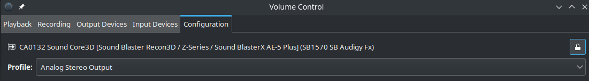
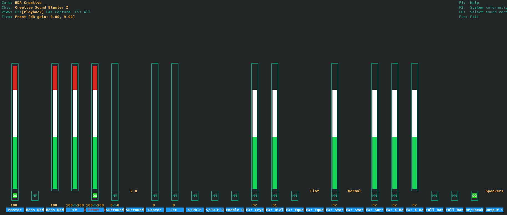

# Table of Contents

- [Update](#update)
  - [Sources.list](#sourceslist)
  - [Firewall](#firewall)
- [DistroHop / Fresh install](#distrohop--fresh-install)
  - [General](#general)
  - [Partitioning used](#partitioning-used)
  - [Swap](#swap)
  - [Encryption (laptop)](#encryption-laptop)
- [User: antti](#user-antti)
- [Login/Boot method](#loginboot-method)
- [Basic stuff](#basic-stuff)
- [Kernel stuff](#kernel-stuff)
- [AMD](#amd)
- [System state - disable all but hibernate](#system-state---disable-all-but-hibernate)
- [System state - disable all](#system-state---disable-all)
- [Bluetooth](#bluetooth)
- [Sensors](#sensors)
- [Keyring](#keyring)
- [Csharp](#csharp)
- [JAVA](#java)
- [SonarQube](#sonarqube)
- [NodeJS](#nodejs)
- [Rust](#rust)
- [Python](#python)
- [Bitwarden](#bitwarden)
- [Microsoft signing key](#microsoft-signing-key)
  - [VSCode](#vscode)
  - [Edge](#edge)
  - [Teams](#teams)
- [Spotify](#spotify)
- [RSync](#rsync)
- [iPhone](#iphone)
- [Bose quietcomfort 35](#bose-quietcomfort-35)
  - [Getting mic to work with bluetooth](#getting-mic-to-work-with-bluetooth)
- [Pulseaudio](#pulseaudio)
- [Webcam](#webcam)
- [Sound Blaster](#sound-blaster)
  - [Pavucontrol / Pulse audio control](#pavucontrol--pulse-audio-control)
  - [Alsamixer](#alsamixer)
- [Steam](#steam)
- [Nginx](#nginx)
- [Must have non apt apps](#must-have-non-apt-apps)

# Update

```bash
# Basic update
sudo apt update
sudo apt full-upgrade

# Flatpak
sudo flatpak update

# Nvidia - check cuda installer for latest driver
```

## Sources.list

```ini
  GNU nano 7.2                                      /etc/apt/sources.list *                                             # debian (fi-mirror)
deb http://www.nic.funet.fi/debian/ trixie main contrib non-free non-free-firmware
deb-src http://www.nic.funet.fi/debian/ trixie main contrib non-free non-free-firmware

# debian
deb http://deb.debian.org/debian/ trixie-updates main non-free contrib non-free-firmware
deb-src http://deb.debian.org/debian/ trixie-updates main non-free contrib non-free-firmware

# backports
# deb http://deb.debian.org/debian trixie-backports main contrib non-free non-free-firmware
# deb-src http://deb.debian.org/debian/ trixie-backports main contrib non-free non-free-firmware

# security
deb http://security.debian.org/debian-security trixie-security main contrib non-free non-free-firmware
deb-src http://security.debian.org/debian-security stable-security main
```

# Firewall

- Set firewall using UFW - Uncomplicated Firewall, its super easy
- [Notes](./firewall.md)

# DistroHop / Fresh install

- Notes for myself when installing or updating some nix box
- Current environment bookworm on Debian & Raspberry Pi OS

## General

- Use LVM if unsure on sizes
- Recommended filesystem types:
  - /var: XFS (good for databases/logs)
  - /home: EXT4 (general purpose)

## Partitioning used

- 512MB EFI (bootable)
- 512MB EXT2 /boot
- swap if used
- / (root) 16GB...128GB
  - space requirement depends whats installed
  - Note: Cuda + TensorRT uses 16GB+ space
- /var (nginx, postgresql)
  - Recommended: 20GB minimum
  - Increase if heavy logging/database usage
- /home (mostly everything is here)
  - Recommended: 50% or more of total space

## Swap

- For hibernation: RAM size + 2GB
  - Example: 64GB RAM = 66GB swap
- No swap if running Redis (can cause performance issues)
- Small swap (2GB) recommended even with large RAM for memory pressure handling

## Encryption (laptop)

- /dev/sda1 512MB EFI (bootable)
- /dev/sda2 512MB /boot ext2
- /dev/sda3 dm-crypt (physical device for encryption)
  - LVM Volume group on sda3_crypt, volumes
    - /
    - swap
    - /home

I made this because it required to have EFI & /boot unencrypted. There I guess is a way to store them also inside the dm-crypt device.

- TODO: Figure out how to store LUKS headers and what else to open device in different machine
- TODO: Figure out how you could reinstall diff distro on encrypted setup

# User: antti

Should have

- id: 1000
- gid: 1000

# Login/Boot method

Console login

```bash
sudo systemctl set-default multi-user.target
sudo systemctl reboot
```

Graphical login

```bash
sudo systemctl set-default graphical.target
sudo systemctl reboot
```

# Basic stuff

```bash
sudo apt install git git-lfs make gcc tcl libssl-dev libsystemd-dev libc6 libgcc-s1 libstdc++6 zlib1g ca-certificates apt-transport-https libfreeimage3 libfreeimage-dev curl cpulimit neofetch smartmontools
```

# Kernel stuff

```bash
sudo apt install linux-image-amd64 linux-headers-amd64 linux-source
```

# Bash (.bash_aliases)

```bash
# Copy this to your home dir as .bash_aliases
# Create also file .bash_tokens to set 'secret' environment variables

# ~/.bashrc: executed by bash(1) for non-login shells.
alias ll='ls -al'
alias pst='ps -auxwf'

# nvidia -Cuda, -cuDNN, -TensorRT libs/binaries (needs install cuda + TensorRT)
# comment if machine missing RTX card
export LD_LIBRARY_PATH=$LD_LIBRARY_PATH:/usr/local/cuda/lib64/:/usr/local/TensorRT/lib
export PATH=$PATH:/usr/local/cuda/bin:/usr/local/TensorRT/bin

# own bin
export PATH=$PATH:~/bin/

# dotnet
export DOTNET_CLI_TELEMETRY_OPTOUT=1
export DOTNET_ROOT=$HOME/dotnet
export PATH=$PATH:$HOME/dotnet

# add to .bash_aliases, globally installed dotnet tools
export PATH=$PATH:$HOME/.dotnet/tools

# inotiyfy instance issue https://github.com/dotnet/aspnetcore/issues/8449
export DOTNET_USE_POLLING_FILE_WATCHER=true

# export java home
export JAVA_HOME=/usr/local/java
# export java path to bin
export PATH=$PATH:$JAVA_HOME/bin

# Add/modify SONAR_HOME and PATH
export SONAR_HOME=/usr/local/sonarqube
export PATH=$PATH:$SONAR_HOME/bin/linux-x86-64

# Add/modify NODE_HOME and PATH
export NODE_HOME=/usr/local/node
export PATH=$PATH:$NODE_HOME/bin

# ssh agent
eval "$(ssh-agent -s)"

# tokens
source .bash_tokens

# Neofetch (use global)
```

# AMD

- use isenkram to install any missing firmware

```bash
sudo apt install isenkram
sudo isenkram-autoinstall-firmware
```

# System state - disable all but hibernate

```bash
sudo systemctl mask sleep.target suspend.target hybrid-sleep.target
```

# System state - disable all

```bash
# keep hibernate.target
sudo systemctl mask sleep.target suspend.target  hybrid-sleep.target
```

# Bluetooth

```bash
sudo apt install bluez bluetooth
```

# Sensors

```bash
sudo apt install lm-sensors psensor
```

# Keyring

```bash
sudo apt install gnome-keyring libqt5keychain1
```

# Csharp

- Installed in home/path (backup), just recreate symlink dotnet -> dotnetX
- Added path to .bash_aliases

# JAVA

Purged APT packages
'''text
default-jdk/stable,now 2:1.17-74 amd64 [installed]
default-jdk-headless/stable,now 2:1.17-74 amd64 [installed,automatic]
default-jre/stable,now 2:1.17-74 amd64 [installed,automatic]
default-jre-headless/stable,now 2:1.17-74 amd64 [installed,automatic]
openjdk-17-jdk/stable-security,now 17.0.14+7-1~deb12u1 amd64 [installed,automatic]
openjdk-17-jdk-headless/stable-security,now 17.0.14+7-1~deb12u1 amd64 [installed,automatic]
openjdk-17-jre/stable-security,now 17.0.14+7-1~deb12u1 amd64 [installed,automatic]
openjdk-17-jre-headless/stable-security,now 17.0.14+7-1~deb12u1 amd64 [installed,automatic]

```

- Purge

```bash
sudo apt purge default-jdk default-jdk-headless default-jre default-jre-headless openjdk-17-jdk openjdk-17-jdk-headless openjdk-17-jre openjdk-17-jre-headless
# shame on pdftk
# default-jdk* default-jdk-headless* default-jre* default-jre-headless* openjdk-17-jdk*
# openjdk-17-jdk-headless* openjdk-17-jre* openjdk-17-jre-headless* pdftk* pdftk-java
sudo apt autoremove
# bye bye for many packages, not sure will this break something...
```

- Get latest version from [adoptium](https://adoptium.net/)
- Just first extract package to Downloads, this will create name like 'jdk-21.0.6+7'
- Then move the folder as sudo to /usr/local/
- Then create symlink to the folder named /usr/local/java

```bash
# Move and create/update symlink
sudo mv ~/Downloads/jdk-21.0.6+7 /usr/local/
sudo ln -s /usr/local/jdk-21.0.6+7 /usr/local/java
```

- Then modify .bash_aliases

```bash
# Add/modify JAVA_HOME and PATH
export JAVA_HOME=/usr/local/java
export PATH=$PATH:$JAVA_HOME/bin
```

# SonarQube

- Download community version from [sonarqube](https://www.sonarsource.com/)
- Just first extract package to Downloads, this will create name like 'sonarqube-25.2.0.102705'
- Then move the folder as sudo to /usr/local/
- Then create symlink to the folder named /usr/local/sonarqube

```bash
# Move and create/update symlink
sudo mv ~/Downloads/sonarqube-25.2.0.102705 /usr/local/
sudo ln -s /usr/local/sonarqube-25.2.0.102705 /usr/local/sonarqube
```

- Then modify .bash_aliases

```bash
# Add/modify SONAR_HOME and PATH
export SONAR_HOME=/usr/local/sonarqube
export PATH=$PATH:$SONAR_HOME/bin/linux-x86-64
# Create admin token (for all access)
# Add/modify your .bash_tokens (all secret stuff goes there)
export SONAR_TOKEN=[your admin token]
```

# NodeJS

- Download latest version from [nodejs](https://nodejs.org/en/)
  - Download prebuild version for linux X64
- Just first extract package to Downloads, this will create name like 'node-v22.13.1-linux-x64'
- Then move the folder as sudo to /usr/local/
- Then create symlink to the folder named /usr/local/node

```bash
# Move and create/update symlink
sudo mv ~/Downloads/node-v22.13.1-linux-x64 /usr/local/
sudo ln -s /usr/local/node-v22.13.1-linux-x64 /usr/local/node
```

- Then modify .bash_aliases

```bash
# Add/modify NODE_HOME and PATH
export NODE_HOME=/usr/local/node
export PATH=$PATH:$NODE_HOME/bin
```

# Rust

No need if using home backup where it is installed

```bash
curl --proto '=https' --tlsv1.3 -sSf https://sh.rustup.rs | sh
```

Can add the following to `/etc/sysctl.conf` increase the limit of amount files to be watched

```bash
fs.inotify.max_user_watches=524288
```

# Spectacle (Screenshots)

```bash
sudo apt install kde-spectacle
```

# Tor Browser

```bash
sudo apt install torbrowser-launcher
```

# Kleopatra (GPG)

```bash
sudo apt install kleopatra
```

# Python

```bash
sudo apt install python3 python3-pip
sudo apt install python3-numpy python3-torch
```

## VLC

```bash
sudo apt install vlc
```

# Bitwarden

You have to manually update every about 3..6 months
Download: <https://bitwarden.com/download/>

```bash
sudo dpkg -i Bitwarden-XXX-amd64.deb
```

# Spotify

Client is now better than browser, but check always first instructions from below.

- Check [instructions(https://www.spotify.com/nl/download/linux/)]

Signing key

```bash
curl -sS https://download.spotify.com/debian/pubkey_C85668DF69375001.gpg | sudo gpg --dearmor --yes -o /etc/apt/trusted.gpg.d/spotify.gpg
```

Package source

```bash
echo "deb http://repository.spotify.com stable non-free" | sudo tee /etc/apt/sources.list.d/spotify.list
```

```bash
sudo apt install spotify-client
```

# RSync

Use rsync to copy/move stuff between hosts

```bash
# a == archive mode; equals -rlptgoD
# v == verbose
# r == recursive
rsync -av Downloads/* antti@god:~/Downloads/
```

# iPhone

```bash
# required tools
sudo apt install libimobiledevice6 libimobiledevice-utils ifuse

# mounting device
# make folder
sudo mkdir /media/iphone
chown -R antti:antti /media/iphone
ifuse /media/iphone

# unmount
fusermount -u /media/iphone
```

# Bose quietcomfort 35

## Getting mic to work with bluetooth

- modify file `/etc/pulse/default.pa`

```conf
# modify line
load-module module-bluetooth-policy
# to
load-module module-bluetooth-policy auto_switch=2
```

- restart pulseaudio & xServer

## Required

```bash
# non free firmware
sudo apt install bluetooth bluez bluez-firmware firmware-linux-nonfree pulseaudio-module-bluetooth

# restart
sudo modprobe -r btusb
sudo modprobe btusb
sudo systemctl restart bluetooth

# status
sudo systemctl status bluetooth
hciconfig -a

# discovery module
pactl load-module module-bluetooth-discover
# check discovery module
pactl list modules | grep bluetooth

# add headphones in bluetoothctl
bluetoothctl

# inside bluetoothctl
remove 2C:41:A1:07:F9:20
power on
scan on
pair 2C:41:A1:07:F9:20
connect 2C:41:A1:07:F9:20
trust 2C:41:A1:07:F9:20

# pulseaudio - set high fidelity playback (A2DP sink)
pactl set-card-profile bluez_card.2C_41_A1_07_F9_20 a2dp_sink

```

# Pulseaudio

- [Pulseaudio systemtray](https://github.com/christophgysin/pasystray)
- List available sources

```bash
pactl list sources
```

Example

```
Source #8
        State: IDLE
        Name: bluez_sink.2C_41_A1_07_F9_20.a2dp_sink.monitor
        Description: Monitor of Bose QC Antti
        Driver: module-bluez5-device.c
        Sample Specification: s16le 2ch 44100Hz
        Channel Map: front-left,front-right
        Owner Module: 25
        Mute: no
        Volume: front-left: 65536 / 100% / 0.00 dB,   front-right: 65536 / 100% / 0.00 dB
                balance 0.00
        Base Volume: 65536 / 100% / 0.00 dB
        Monitor of Sink: bluez_sink.2C_41_A1_07_F9_20.a2dp_sink
        Latency: 0 usec, configured 39512 usec
        Flags: DECIBEL_VOLUME LATENCY
        Properties:
                device.description = "Monitor of Bose QC Antti"
                device.class = "monitor"
                device.string = "2C:41:A1:07:F9:20"
                device.api = "bluez"
                device.bus = "bluetooth"
                device.form_factor = "headphone"
                bluez.path = "/org/bluez/hci0/dev_2C_41_A1_07_F9_20"
                bluez.class = "0x240418"
                bluez.alias = "Bose QC Antti"
                device.icon_name = "audio-headphones-bluetooth"
        Formats:
                pcm
```

# Webcam

```bash
sudo apt install cheese
```

# Sound Blaster

- Most likely package: `firmware-misc-nonfree` has to be installed
  - sound blaster has dsp
- I also downloaded [latest alsa-firmware](https://www.alsa-project.org/)
  - configure, compile, install
  - most likely useless and system already has this installed
- Install `alsa-utils` to get alsamixer where you can see devices and configure them
- Install `pavucontrol` to configure pulseaudio in kde, pulseaudio runs on top of alsa

## Pavucontrol / Pulse audio control

Configuration tab should include the device, when here you select profile it resets all settings
which you can see in alsamixer (So after you get it working selecting new profile will break it).



## Alsamixer

This is the tricky part as by default, I guess only optical is on as I did not hear any sound before accidentally hitting settings that made sound come out of the headphone/lineout jack.

Pressing `m` you can enable/disable settings. When you see green `00` letters it means its on, `MM` means it's off. Here is a screenshot of the working settings (with all sound FX disabled).



# Steam

***STEAM ACTUALLY RUNS EVEN THO UNINSTALLED ALL NVIDIA PACKAGES*** so on other machine installed debian nvidia driver, dependencies and got steam running. Purged all nvidia packages (including driver) to install driver using cuda installer, steam still runs after that.

Has lot's of dependencies which be installed in progress, especially if no gnome installed from distro, but still there will be packages for sure.

```bash
# steam requires 32-bit libraries
sudo dpkg --add-architecture i386

# Download installer https://store.steampowered.com/about/download

sudo dpkg -i steam_latest.deb

# might need to fix install
sudo apt --fix-broken install

# run steam, should install if something still needed
# after this you can install nvidia cuda, cudnn & tensort...
```

# Nginx

```bash
sudo apt install nginx-full
```

# Microsoft

- ***Microsoft changes everything all the time***
- Always check for latest...

## Microsoft signing key

```bash
curl https://packages.microsoft.com/keys/microsoft.asc | gpg --dearmor > microsoft.gpg
sudo install -o root -g root -m 644 microsoft.gpg /usr/share/keyrings/
rm microsoft.gpg
```

## VSCode

Set package source

```bash
sudo sh -c 'echo "deb [arch=amd64,arm64,armhf signed-by=/usr/share/keyrings/microsoft.gpg] https://packages.microsoft.com/repos/code stable main" > /etc/apt/sources.list.d/vscode.list'
```

Install either

```bash
sudo apt install code
```

```bash
sudo apt install code-insiders
```

## Edge

Set package source

```bash
sudo sh -c 'echo "deb [arch=amd64 signed-by=/usr/share/keyrings/microsoft.gpg] https://packages.microsoft.com/repos/edge stable main" > /etc/apt/sources.list.d/microsoft-edge-beta.list'
```

Beta updates every 4 weeks, dev every week.
Install either

```bash
sudo apt install microsoft-edge-beta
```

```bash
sudo apt install microsoft-edge-dev
```

## Teams

Set package source

```bash
# this seems to be the correct one
sudo sh -c 'echo "deb [arch=amd64 signed-by=/usr/share/keyrings/microsoft.gpg] https://packages.microsoft.com/repos/ms-teams stable main" > /etc/apt/sources.list.d/teams.list'

# but all sources are zero so it has been used but somehow wiped content...
# 13-Nov-2023 16:08 all files from repo have been wiped
sudo apt update
sudo apt install teams
```

# Must have non apt apps

- [See software.md](./software.md)
